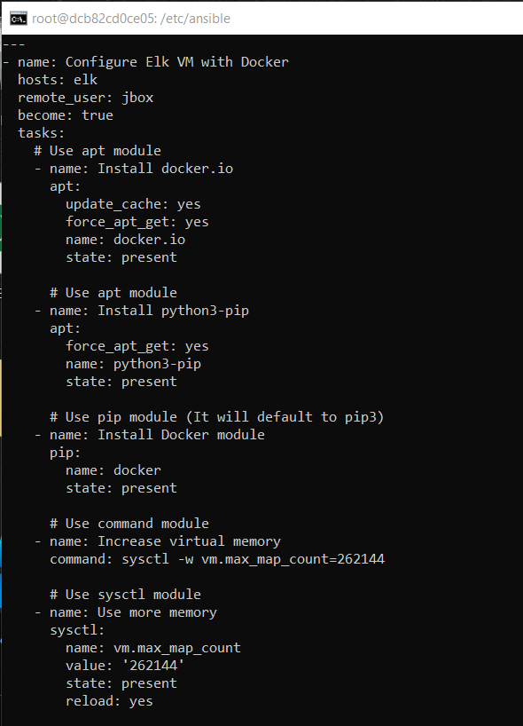
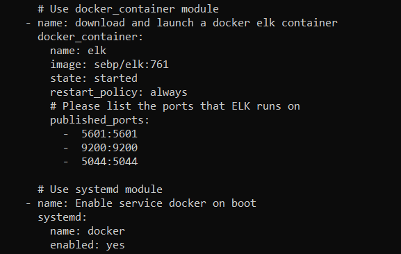
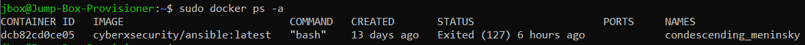
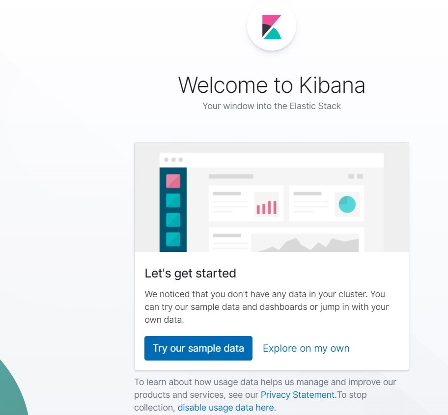

# ELK-STACK
## Automated ELK Stack Deployment

The files in this repository were used to configure the network depicted below.

These files have been tested and used to generate a live ELK deployment on Azure. They can be used to either recreate the entire deployment pictured above. Alternatively, select portions of the Beats file may be used to install only certain pieces of it, such as Filebeat.
 

This document contains the following details:
- Description of the Topologu
- Access Policies
- ELK Configuration
  - Beats in Use
  - Machines Being Monitored
- How to Use the Ansible Build

### Description of the Topology

The main purpose of this network is to expose a load-balanced and monitored instance of DVWA, the D*mn Vulnerable Web Application.

Load balancing ensures that the application will be highly available, in addition to restricting inbound access to the network.
-The load balancer ensures that work to process incoming traffic will be shared by all three vulnerable web servers. Access controls will ensure that only authorized users — namely, ourselves — will be able to connect. The "Jump Box Provisioner", protected by a firewall, plays the role of the  "gateway" the only access way in to the internal network.

Integrating an ELK server allows users to easily monitor the vulnerable VMs for changes to the files and system metrics.
- Filebeat collects data about the file system. Filebeat enables analysts to monitor files for suspicious changes.
- Metricbeat collects machine metrics. A metric is simply a measurement about an aspect of a system that tells analysts how "healthy" it is. Machine metrics including monitoring, cpu (central processing unit) usage: the heavier the load on a machine's CPU, the more likely it is to fail. Analysts often receive alerts when CPU usage gets too high; uptime: a measure of how long a machine has been on. Servers are generally expected to be available for a certain percentage of the time, so analysts typically track uptime to ensure your deployments meet service-level agreements (SLAs). Metricbeat makes it easy to collect specific information about the machines in the network.

The configuration details of each machine may be found below.

| Name     | Function | IP Address  | Operating System |
|----------|----------|-------------|------------------|
| Jump Box | Gateway  |52.170.45.247| Linux            |
| Jump Box | Gateway  | 10.0.0.4    | Linux            |
| DVWA 1   |Webserver | 10.0.0.5    | Linux            |
| DVWA 2   |Webserver | 10.0.0.6    | Linux            |
| DVWA 3   |Webserver | 10.0.0.7    | Linux            |
| ELK      |Monitoring| 10.2.0.0    | Linux            |

### Access Policies

The machines on the internal network are not exposed to the public Internet. 

Only the "Jump Box Provisioner" machine can accept connections from the Internet. Access to this machine is only allowed from the following IP addresses:
- 107.201.134.111 to 52.170.45.247

Machines within the network can only be accessed by "ssh" Jump Box Provisioner internal IP address 10.0.0.4
- Access in to the ELK server can only be accessed by Jump Box Provisioner internal IP address 10.0.0.4

A summary of the access policies in place can be found in the table below.

| Name     | Publicly Accessible | Allowed IP Addresses |
|----------|---------------------|----------------------|
| Jump Box | Yes                 | 52.170.45.247        |
| Jump Box | No                  | 10.0.0.4             |
| DVWA 1   | No                  | 10.0.0.5             |
| DVWA 2   | No                  | 10.0.0.6             |
| DVWA 3   | No                  | 10.0.0.7             |
| ELK      | No                  | 10.2.0.0             |

### Elk Configuration

Ansible was used to automate configuration of the ELK machine. No configuration was performed manually, which is advantageous because...
- Ansible is an open source tool.
- Simple to set up and use. No special coding necessary.
- Allows model of highly complex workflows.
- Flexiable; allows customization based on needs.
- Agentless; does not need any software, management system or firewall ports.
- Efficient; doe snot utilize alot of resources.

The "install-elk" playbook implements the following tasks:
- Install the following "apt" packages:
  - "docker.io": The Docker engine, used for running containers.
  - "python3-pip": Package used to install Python software.

- Install the following Docker module "pip" package:
  - "docker": Python client for docker. Required by Ansbile to control the state of Docker containers.
  
- Set the "vm.max_map_count" to "262144".
  - This configures the "ELK" VM (the machine being configured) to use more memory virtual memory. 
  - The ELK container will not run without this setting.
   
- Use Ansible's "sysctl" module and configure it so that this setting is automatically run if your VM has been restarted.
  
- Download the docker container module called "sebp/elk:761". 
  - "sebp" is the organization that made the container. 
  - "elk" is the container.
  - "761" is the version.

- Configures the container to start with the following port mappings:
  - 5601:5601
  - 9200:9200
  - 5044:5044

- Start the container.

- Use systemd module 
  - Enables the "docker" service on boot, so that if you restart your "ELK" VM, the docker service start up automatically.

The following screenshot displays the result of running `docker ps` after successfully configuring the ELK instance.

### Target Machines & Beats
This ELK server is configured to monitor the following machines:
- 10.0.0.5
- 10.0.0.6
- 10.0.0.7

We have installed the following Beats on these machines:
- Filebeat
- Metricbeat

These Beats allow us to collect the following information from each machine:
- Filebeat helps generate and organize log files to send to Logstash and Elasticsearch. Specifically, it logs information about the file system, including which files have   
  changed and when.
- Filebeat is often used to collect log files from very specific files, such as those generated by Apache, Microsoft Azure tools, the Nginx web server, and MySQL databases. Since Filebeat is built to collect data about specific files on remote machines, it must be installed on the VMs you want to monitor.
 

- Metricbeat collects machine metrics from the operating system and from services running on the server such as Apache and MySQL databases.
- Metricbeat takes the metrics and statistics that it collects and sends them to Elasticsearch or Logstash.

### Using the Playbook
In order to use the playbook, you will need to have an Ansible control node already configured. Assuming you have such a control node provisioned: 

SSH into the control node and follow the steps below:
- Copy the playbook files to the Ansible container.
- Update the hosts file to include the ELK server IP address.
- Run the playbook, and navigate to each webserver internal ip address to check that the installation worked as expected.

- Ansible reads YAML code. The YAML code is written in to a file for Ansible to read. The YAML file extension is ".yml". A YAML file is denoted with three hyphens on the first line of the file. Ansible documentation calls these files "playbooks" because they are used to run a set of "plays" or "actions" on a server.

- Copy the playbooks to the /etc/ansible/ directory. 
- Next, you must create a hosts file to specify which webservers to run each playbook on. Specify each machine by ip address. 
- Run the command "ansible-playbook" and specify which "yml." playbook installation you want installed on which specific server.
- After all configurations are complete:
  - Run "curl http://[ELK internal ip address]:5601". This is the address of Kibana. If the installation succeeded, this command should print HTML to the console.
- Verify that you can access your server by navigating to http://[use the public IP address of your new VM]:5601/app/kibana. 
- You should see this webpage:

