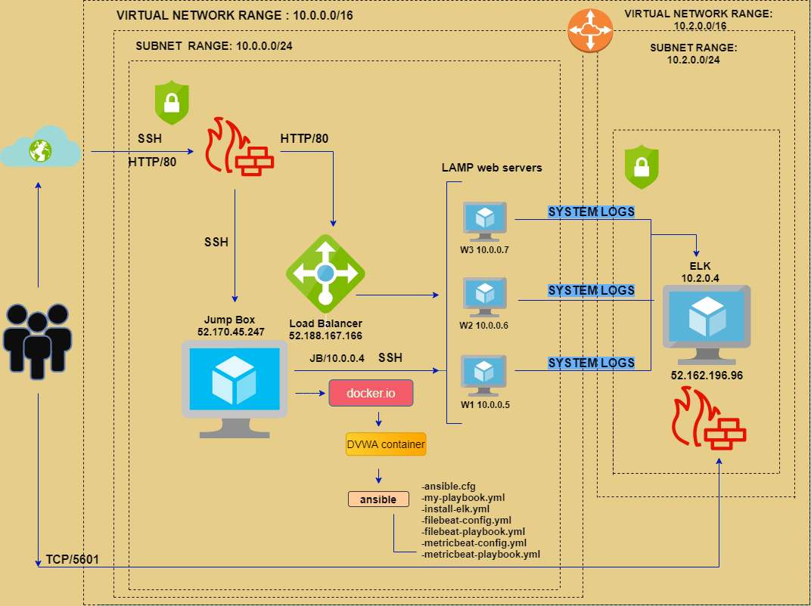

# ELK-STACK
## Automated ELK Stack Deployment

The files in this repository were used to configure the network depicted below.

These files have been tested and used to generate a live ELK deployment on Azure. They can be used to either recreate the entire deployment pictured above. Alternatively, select portions of the Beats file may be used to install only certain pieces of it, such as Filebeat.

-filebeat-configuration.yml 
-filebeat-playbook.yml

This document contains the following details:
- Description of the Topologu
- Access Policies
- ELK Configuration
  - Beats in Use
  - Machines Being Monitored
- How to Use the Ansible Build

### Description of the Topology

The main purpose of this network is to expose a load-balanced and monitored instance of DVWA, the D*mn Vulnerable Web Application.

Load balancing ensures that the application will be highly available, in addition to restricting inbound access to the network.
-The load balancer ensures that work to process incoming traffic will be shared by all three vulnerable web servers. Access controls will ensure that only authorized users — namely, ourselves — will be able to connect. The "Jump Box Provisioner", protected by a firewall, plays the role of the  "gateway" the only access way in to the internal network.

Integrating an ELK server allows users to easily monitor the vulnerable VMs for changes to the files and system metrics.
- Filebeat collects data about the file system. Filebeat enables analysts to monitor files for suspicious changes.
- Metricbeat collects machine metrics. A metric is simply a measurement about an aspect of a system that tells analysts how "healthy" it is. Machine metrics including monitoring, cpu (central processing unit) usage: the heavier the load on a machine's CPU, the more likely it is to fail. Analysts often receive alerts when CPU usage gets too high; uptime: a measure of how long a machine has been on. Servers are generally expected to be available for a certain percentage of the time, so analysts typically track uptime to ensure your deployments meet service-level agreements (SLAs). Metricbeat makes it easy to collect specific information about the machines in the network.

The configuration details of each machine may be found below.

| Name     | Function | IP Address  | Operating System |
|----------|----------|-------------|------------------|
| Jump Box | Gateway  |52.170.45.247| Linux            |
| Jump Box | Gateway  | 10.0.0.4    | Linux            |
| DVWA 1   |Webserver | 10.0.0.5    | Linux            |
| DVWA 2   |Webserver | 10.0.0.6    | Linux            |
| DVWA 3   |Webserver | 10.0.0.7    | Linux            |
| ELK      |Monitoring| 10.2.0.0    | Linux            |

### Access Policies

The machines on the internal network are not exposed to the public Internet. 

Only the "Jump Box Provisioner" machine can accept connections from the Internet. Access to this machine is only allowed from the following IP addresses:
-From 107.201.134.111 to 52.170.45.247

Machines within the network can only be accessed by "ssh" Jump Box Provisioner internal IP address 10.0.0.4
-Access in to the ELK server can only be accessed by Jump Box Provisioner internal IP address 10.0.0.4

A summary of the access policies in place can be found in the table below.

| Name     | Publicly Accessible | Allowed IP Addresses |
|----------|---------------------|----------------------|
| Jump Box | Yes                 | 52.170.45.247        |
| Jump Box | No                  | 10.0.0.4-251         |
| DVWA 1   | No                  | 10.0.0.5-250         |
| DVWA 2   | No                  | 10.0.0.6-249         |
| DVWA 3   | No                  | 10.0.0.7-248         |

### Elk Configuration

Ansible was used to automate configuration of the ELK machine. No configuration was performed manually, which is advantageous because...
- Ansible is an open source tool.
- Simple to set up and use. No special coding necessary.
- Allows model of highly complex workflows.
- Flexiable; allows customization based on needs.
- Agentless; does not need any software, management system or firewall ports.
- Efficient; doe snot utilize alot of resources.

The playbook implements the following tasks:
- _TODO: In 3-5 bullets, explain the steps of the ELK installation play. E.g., install Docker; download image; etc._
- ...
- ...

The following screenshot displays the result of running `docker ps` after successfully configuring the ELK instance.

### Target Machines & Beats
This ELK server is configured to monitor the following machines:
- _TODO: List the IP addresses of the machines you are monitoring_

We have installed the following Beats on these machines:
- _TODO: Specify which Beats you successfully installed_

These Beats allow us to collect the following information from each machine:
- _TODO: In 1-2 sentences, explain what kind of data each beat collects, and provide 1 example of what you expect to see. E.g., `Winlogbeat` collects Windows logs, which we use to track user logon events, etc._

### Using the Playbook
In order to use the playbook, you will need to have an Ansible control node already configured. Assuming you have such a control node provisioned: 

SSH into the control node and follow the steps below:
- Copy the _____ file to _____.
- Update the _____ file to include...
- Run the playbook, and navigate to ____ to check that the installation worked as expected.

_TODO: Answer the following questions to fill in the blanks:_
- _Which file is the playbook? Where do you copy it?_
- _Which file do you update to make Ansible run the playbook on a specific machine? How do I specify which machine to install the ELK server on versus which to install Filebeat on?_
- _Which URL do you navigate to in order to check that the ELK server is running?

_As a **Bonus**, provide the specific commands the user will need to run to download the playbook, update the files, etc._
